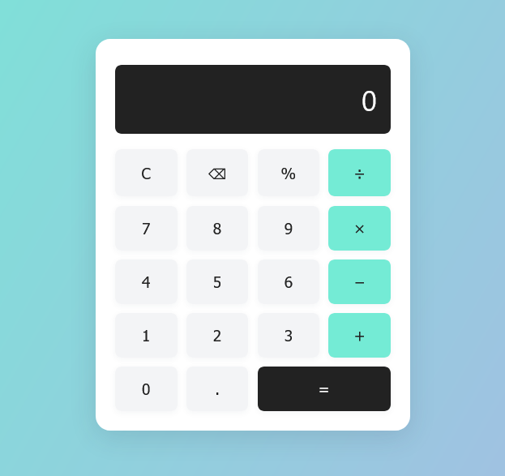

# Calculator App

A modern, responsive calculator built with HTML, CSS, and JavaScript. Supports basic arithmetic, percent, clear, backspace, and keyboard input.

## 🚀 Features
- Basic arithmetic: +, −, ×, ÷
- Percent, clear, and backspace
- Responsive design
- Keyboard support
- Error handling (e.g., division by zero)

## 📸 Screenshot


## 🛠 Technologies Used
- HTML5
- CSS3 (Flexbox, gradients)
- JavaScript (ES6+)

## 📦 File Structure
```
13_Calculator_App/
│-- index.html
│-- style.css
│-- script.js
│-- README.md
```

## ⚙️ How It Works
- Click buttons or use your keyboard to enter numbers and operations.
- Press C to clear, ⌫ to backspace, % for percent, and = or Enter to calculate.

## 🔧 Installation & Usage
1. Open `index.html` in your browser.
2. Use the calculator!

---

Enjoy calculating! 🧮
