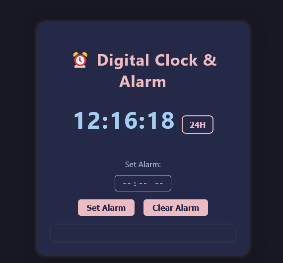

# ⏰ Digital Clock & Alarm

A modern digital clock with a simple alarm feature. Switch between 12-hour and 24-hour formats, set an alarm, and get notified with sound and animation when the alarm rings.

Live Demo: soon to be available

---

## 🚀 Features
- Real-time digital clock display
- 12-hour / 24-hour format toggle
- Set and clear alarm easily
- Animated alarm ring and sound notification
- Responsive, accessible, and mobile-friendly UI

---

## 🛠️ Concepts Used
- JavaScript Date and time manipulation
- setInterval for real-time updates
- DOM manipulation and event handling
- CSS gradients, transitions, and keyframe animations
- Responsive and accessible design

---

## 📸 Screenshot


---

## 🔧 Installation
1. Clone this repository or copy the `14_Digital_Clock_&_Alarm` folder:
   ```bash
   git clone https://github.com/vikky2810/20-JavaScript-Projects.git
   cd 20-JavaScript-Projects/14_Digital_Clock_&_Alarm
   ```
2. Open `index.html` in your browser.

---

## 🏗️ Usage
- The clock updates in real time.
- Use the **24H/12H** button to switch time format.
- Set an alarm using the time input and click **Set Alarm**.
- When the alarm time is reached, you'll hear a sound and see an animation.
- Click **Clear Alarm** to remove the alarm.

---

## 📚 Credits
- Alarm sound: [mixkit.co](https://mixkit.co/free-sound-effects/alarm/)

---

Enjoy your new digital clock and alarm! ⏰
