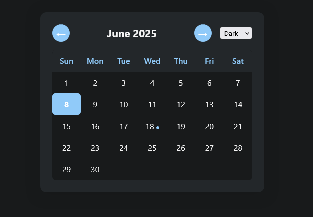

# Customizable Calendar

A simple, customizable calendar web app built with HTML, CSS, and JavaScript. Navigate months, switch between light and dark themes, and view today's date highlighted.

## Features
- Month and year navigation
- Light/Dark theme switcher (remembers your choice)
- Responsive design for mobile and desktop
- Highlights the current day
- **Add, edit, and delete events for any date**
- **Event days are marked with a colored dot**
- **Custom modal popup for event editing, matching the calendar theme**
- **Event tooltips: Hover over a date with an event to preview its details**
- All data is saved in your browser's localStorage

## Usage
1. Open `index.html` in your browser.
2. Use the left/right arrows to change months.
3. Use the theme dropdown to switch between light and dark mode.
4. Click any date to add, edit, or delete an event.
5. Hover over a date with a dot to see the event details.

## Customization Ideas
- Add year dropdown for quick navigation
- Add localization for weekdays/months
- Add persistent events with localStorage
- Add recurring events or reminders
- Export/import calendar data

## Preview

---

**Project by Vikram Kamble**
