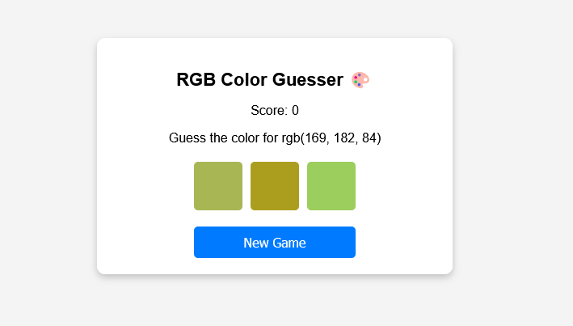

# RGB Color Guesser 🎨

A fun and interactive game where the player has to guess the correct color based on an RGB value. The game provides three color options, and the player earns points for correct guesses.

## Features
- Generates a random RGB value.
- Displays three color choices, including the correct one.
- Tracks the player's score.
- Responsive design for all screen sizes.
- Simple UI with interactive feedback.

## Technologies Used
- HTML
- CSS
- JavaScript

## How to Play
1. The game will display an RGB color value (e.g., `rgb(255, 0, 0)`).
2. Choose the correct color from the three displayed options.
3. If correct, you earn a point. If incorrect, the score resets to 0.
4. Click the **New Game** button to start a new round.

## Files Structure
```
RGB-Color-Guesser/
│── index.html    # Main HTML file
│── style.css     # Styling file for UI
│── script.js     # Game logic and interactivity
│── README.md     # Project documentation
```

## Installation
1. Clone the repository:
   ```sh
   git clone https://github.com/vikky2810/RGB-Color-Guesser.git
   ```
2. Open `index.html` in a browser to play.

## Screenshot
 *(Add an actual screenshot of your project here)*

## Future Improvements
- Add a timer for each round.
- Implement different difficulty levels.
- Include sound effects for better user experience.

## License
This project is open-source and available under the MIT License.

---
Enjoy playing! 🎨

