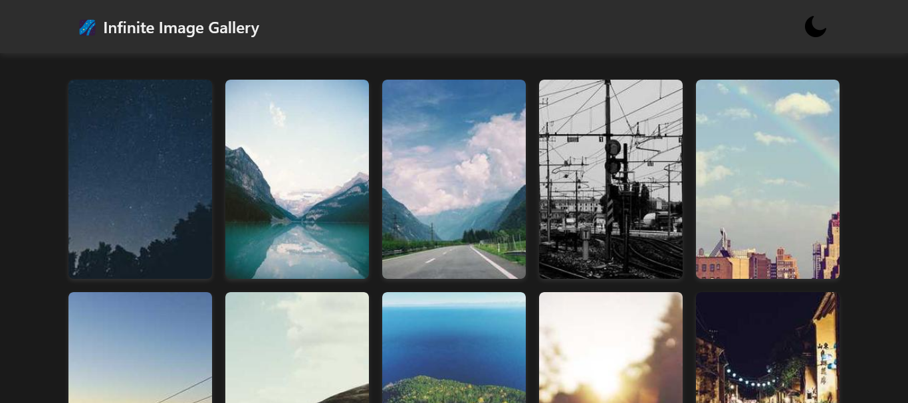

# Infinite Scroll Gallery 📸

A dynamic and interactive image gallery that loads new images as the user scrolls down. This project uses the **Intersection Observer API** to detect when the user reaches the bottom and fetches images from an API in real-time.

Live preview: https://infiscroll.vercel.app

## Features
- Automatically loads new images as the user scrolls.
- Uses API calls to fetch high-quality images dynamically.
- Optimized performance with lazy loading.
- Fully responsive design for all screen sizes.

## Technologies Used
- HTML
- CSS
- JavaScript
- Intersection Observer API
- Fetch API

## How It Works
1. When the page loads, an initial set of images is displayed.
2. As the user scrolls, the **Intersection Observer API** detects when they are near the bottom.
3. A new batch of images is fetched and added dynamically.
4. The process continues, creating an infinite scrolling effect.

## Screenshot
 

## Future Improvements
- Add loading indicators for a better user experience.
- Implement filters to sort images by categories.
- Optimize image loading with lazy loading strategies.

---
Enjoy browsing! 📸
