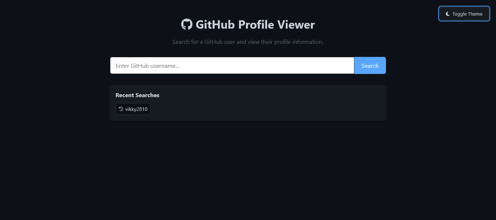
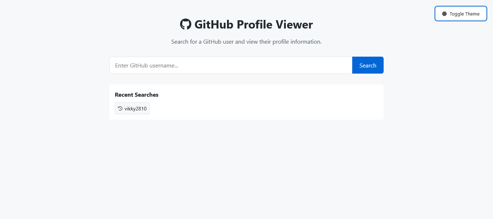

# 🌐 GitHub Profile Viewer

A clean, accessible, and responsive web application to search for GitHub users and view their public profile information, including repositories, followers, bio, and contribution stats.



Deploy Link : [LINK](github-profile-viewer-livid.vercel.app)

## 🔍 Features

- 🔎 Search any GitHub user
- 👤 View avatar, bio, followers, and public repo count
- 📁 Display recent public repositories
- 🌗 Toggle between light and dark themes
- 📜 Displays search history
- 🔁 Shows total GitHub contributions using a public API

## 🛠️ Built With

- ✅ **HTML5** – Semantic structure with accessibility in mind
- ✅ **CSS3** – Responsive design with theme toggling
- ✅ **JavaScript (Vanilla)** – API fetching, DOM manipulation
- ✅ [GitHub REST API](https://docs.github.com/en/rest)
- ✅ [GitHub Contributions API](https://github-contributions-api.deno.dev/) – for contributions data

## 🚀 Getting Started

### 📦 Installation

1. Clone the repository:
   ```bash
   git clone https://github.com/vikky2810/20-JavaScript-Projects.git
   cd 9_Github_Profile_Viewer
   ```

2. Open `index.html` in your browser.

> 💡 No build tools or frameworks required — pure HTML, CSS, and JS.

---

### 🖼️ Screenshots

| Light Mode | Dark Mode |
|------------|-----------|
|  |  |

---

## ⚙️ Usage

- Enter any GitHub username (e.g., `torvalds`, `octocat`)
- Press "Search" or hit `Enter`
- View profile details and recent repositories
- Toggle theme using the 🌞/🌙 button
- Review recent search history under the input box

---

## 🧠 Learnings

- Using GitHub REST APIs and handling errors gracefully
- DOM manipulation for dynamic UI
- Accessibility practices (`aria-*`, `role`, keyboard support)
- API chaining and async/await
- Using third-party public APIs responsibly

---

## 🛡️ Accessibility Features

- Proper semantic roles (e.g., `role="main"`, `role="alert"`)
- ARIA labels and descriptions
- Keyboard navigation support
- Responsive on desktop and mobile

---

## 🧑‍💻 Author

- **Vikram Kamble** – [@vikram-kamble](https://github.com/vikky2810)

---


## 🌟 Show Your Support

Give a ⭐️ if you found this project helpful!

